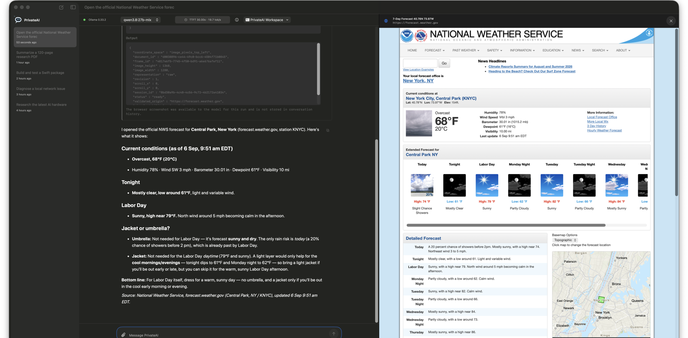

<div align="center">

# PrivateAI

### A private, native AI agent for your Mac

Run local Ollama models in a polished macOS app with document analysis, supervised terminal execution, native Mac tools, and screenshot-driven browser computer use.

[](https://github.com/jacobjiangwei/Private-AI-on-your-device/releases/latest)
[](https://github.com/jacobjiangwei/Private-AI-on-your-device/actions/workflows/signed-macos-build.yml)
[](LICENSE)
[](https://www.swift.org/)
[](https://ollama.com/)

**[Download the latest signed macOS release](https://github.com/jacobjiangwei/Private-AI-on-your-device/releases/latest)**
&nbsp;&nbsp;·&nbsp;&nbsp;
**[Build from source](#build-from-source)**

</div>



PrivateAI is an open-source, on-device AI assistant built specifically for macOS. Conversations and model inference stay on your Mac through Ollama. When a task needs more than chat, the Agent can inspect local documents, run supervised shell work, call native macOS services, or operate a real WebKit browser from screenshots.

## Why PrivateAI

| | Capability | What it means |
| --- | --- | --- |
| **Local intelligence** | Ollama model runtime | Choose compatible models already installed on your Mac. Stream thinking and answers without sending model inference to a hosted AI service. |
| **Visual web agent** | Screenshot-driven computer use | PrivateAI opens a live `WKWebView`, sends the rendered frame to a vision-capable local model, and performs frame-bound scroll, click, typing, and navigation actions. |
| **Document workflows** | PDFs, Markdown, text, data, and source files | Attach or reference local documents, search bounded content, and run resumable whole-document analysis with private checkpoints. |
| **Terminal capability** | Supervised local `zsh` execution | Run diagnostics, scripts, builds, tests, pipelines, and package managers with visible status, bounded output, cancellation, timeout, and process-tree cleanup. |
| **Native Mac context** | Apple frameworks | Inspect device, locale, time zone, storage, power, network, permissions, location, places, calendars, reminders, contacts, and notifications where authorized. |
| **Local history** | Native SwiftData conversations | Keep conversations in a native macOS interface with Markdown, syntax, table, and KaTeX rendering. |

## Browser Computer Use

Modern websites are often applications rather than static documents. PrivateAI's Browser capability uses the rendered page instead of pretending every site can be reduced to HTML text:

1. A real App-hosted `WKWebView` loads the public HTTPS page.
2. PrivateAI captures the visible frame and sends the same bounded JPEG to a local vision model.
3. The model chooses one visual action against that exact `frame_id`.
4. PrivateAI validates the frame and performs the scroll, click, text entry, key press, or navigation.
5. A new frame closes the loop before the model acts again.

The live browser opens beside the conversation in a draggable split view. Browser frames are retained locally under:

```text
~/.privateAI/logs/browser-frames/
```

Each filename includes its capture time and frame UUID:

```text
yyyyMMdd-HHmmss-SSS_<frame-uuid>.jpg
```

Password and file inputs are not passed through model-visible browser arguments. The current implementation uses an ephemeral WebKit data store and does not import Safari history, passwords, extensions, or the user's everyday browser profile.

See [Browser Computer Use Design](docs/product/browser-computer-use-design.md) for the execution contract, network boundary, evidence levels, and known limitations.

## Local Documents

- Attach documents with the file picker or Finder drag and drop.
- Reference an existing local file directly using canonical, quoted, shell-escaped, tilde-prefixed, or local `file://` paths.
- Preview and search searchable PDFs, Markdown, plain text, HTML, JSON, CSV, XML, YAML, and common source files.
- Summarize or review large documents with resumable hierarchical analysis and private local checkpoints.
- Keep document conversations isolated from public web, terminal, and native service Tools.

Scanned PDFs without an extractable text layer are not currently supported because OCR is not implemented. The verified format matrix and storage rules are documented in [Document Attachments](docs/product/document-attachments.md).

## Terminal And Native Tools

Ordinary non-document conversations receive the Terminal capability when the signed execution worker is available. Commands begin in the managed `~/.privateAI/workspaces/default` workspace unless the user chooses another folder.

Terminal jobs expose their command, working directory, elapsed time, checkpoints, and Stop control. Output is drained to bounded local logs, and cancellation, timeout, App shutdown, worker failure, and transport timeout terminate the recorded process group.

The current phase is non-interactive: persistent detached servers, PTY applications, secret input, and privileged execution are not supported. See [Terminal Execution Design](docs/product/terminal-execution-design.md).

Native Mac Tools use platform frameworks and remain subject to the real authorization state of the running App. A schema or catalog entry is not treated as proof that a protected capability succeeded on a particular Mac.

## Privacy Model

PrivateAI is local-first, not "network never used."

- Model inference runs through the user's local Ollama service.
- Conversations are stored locally with SwiftData.
- Imported documents are copied to private managed storage under `~/.privateAI/artifacts`.
- Document bytes and extracted text are not written to message rows or runtime logs.
- Public web access occurs only when the Agent invokes an available Web or Browser capability.
- Browser screenshots sent to the local vision model are also retained locally for inspection under `~/.privateAI/logs/browser-frames`.
- Runtime logs redact known secret fields, but users should not place passwords, tokens, or private keys in prompts or Tool arguments.

Read the full [Privacy Policy](docs/privacy-policy.md) and [Security Policy](SECURITY.md).

## Install

### Download

Download `PrivateAI.dmg` and `PrivateAI.dmg.sha256` from the [latest GitHub Release](https://github.com/jacobjiangwei/Private-AI-on-your-device/releases/latest). Releases are Developer ID signed, notarized by Apple, stapled, and Gatekeeper-validated in CI.

Optional: verify the downloaded image checksum:

```bash
shasum -a 256 -c PrivateAI.dmg.sha256
```

PrivateAI requires macOS and a running [Ollama](https://ollama.com/) installation with a compatible local chat model. Browser computer use additionally requires a model that reports both vision and Tool-calling capabilities.

### Build From Source

1. Install Xcode with the SDK required by the project's deployment target.
2. Open `Private AI/Private AI.xcodeproj`.
3. Select the `Private AI` scheme.
4. Build and run the macOS app.

The checked-in Team ID and bundle identifiers are public project metadata, not signing credentials. Other contributors should select their own Apple Development team and use a unique bundle identifier under Signing & Capabilities.

## Development

Run the fast local verification suite:

```bash
./scripts/test_fast.sh
```

The repository includes Swift package tests, macOS App tests, direct framework integrations, deterministic fixtures, and opt-in real Ollama acceptance scenarios. Contract tests, direct executor tests, and model-driven App acceptance are reported separately because they prove different things.

The product architecture and capability boundaries are documented in:

- [Target Architecture](docs/product/target-architecture-draft.md)
- [Browser Computer Use](docs/product/browser-computer-use-design.md)
- [Terminal Execution](docs/product/terminal-execution-design.md)
- [Document Attachments](docs/product/document-attachments.md)
- [Direct Release](docs/direct-release.md)

## Project Status

PrivateAI is under active development and its internal architecture may change. The repository currently contains real executors for local documents, public web fetch/search, native Mac services, supervised terminal work, and screenshot-driven browser interaction. Availability still depends on the selected Ollama model, macOS permissions, public services, network conditions, and the signed App environment.

## Contributing

Issues and pull requests are welcome. Start with [CONTRIBUTING.md](CONTRIBUTING.md). Do not post secrets, private documents, chat transcripts, or browser screenshots in public issues.

## License

PrivateAI is available under the [Apache License 2.0](LICENSE). See [THIRD_PARTY_NOTICES.md](THIRD_PARTY_NOTICES.md) for bundled dependencies and redistributable components.