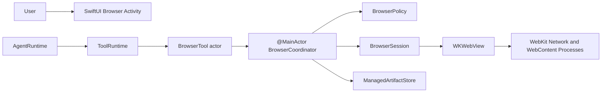
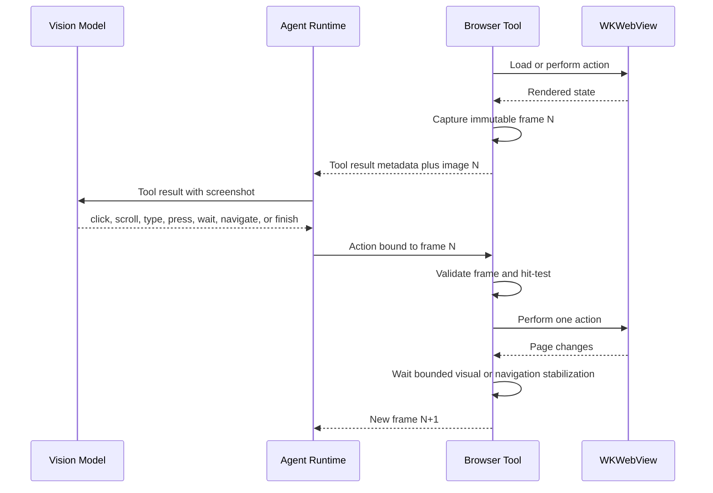

# Browser Computer Use Design

- Status: Partially implemented
- Date: 2026-09-05
- Scope: App-hosted browser automation for public web research and interaction

## Decision Summary

PrivateAI can provide screenshot-driven browser computer use without Python. The first implementation should use an App-hosted `WKWebView`, controlled by a `@MainActor` browser coordinator and exposed to the model through a new stateful `browser` Tool.

The existing `web` Tool should remain as an optional low-latency, stateless path for known readable pages and structured search providers. The screenshot browser is the primary path for unknown modern websites, search-engine result pages, JavaScript-rendered content, pagination, scrolling, forms, and navigation. It must not silently retry network-policy failures or assume that a browser can reach a host that is unreachable at DNS, TCP, TLS, proxy, or VPN level.

The first version is screenshot-first. After every browser action, PrivateAI captures the visible viewport and returns that image to the vision model in the browser Tool result. The model sees the rendered page and proposes the next coordinate click, scroll, text entry, key press, or navigation action against that exact frame. DOM and accessibility data are optional executor-side aids for input validation, risk classification, secure-field detection, and compact hints; they are not the model's primary representation of the page.

This direction is feasible with the local stack already installed on the development Mac. On 2026-09-05, Ollama 0.33.2 reported that `qwen3.8:latest` supports `completion`, `vision`, `tools`, and `thinking`. A direct `/api/chat` probe successfully supplied a PNG and received a coordinate-bearing Tool call. A second probe successfully supplied the PNG on a `role: tool` message and received the next Tool call. These probes establish protocol feasibility only; the production App does not yet encode images or implement browser execution.

The browser capability is not considered complete until a signed App, a real Ollama model, the production Tool catalog, the real `WKWebView` executor, and the final user-visible answer all pass realistic end-to-end scenarios against independently established ground truth.

## Why This Is a Separate Capability

The current `web` Tool and the proposed browser solve different problems:

| Capability | `web` | `browser` |
| --- | --- | --- |
| State | Stateless | Stateful session |
| Executor | `URLSession` and structured parsers | `WKWebView` and WebKit processes |
| Best use | Search results, known pages, text and JSON | JavaScript pages, scrolling, clicking, forms |
| Typical latency | Low | Higher |
| Concurrency | Safe for independent requests | Serial within one browser session |
| Model input | Bounded extracted text | Viewport screenshot plus small trusted metadata |
| User visibility | Tool transcript | Live browser activity panel |
| Main risk | Network failure and parser drift | Side effects, prompt injection, stale UI state |

Merging both behaviors into one large Tool would make concurrency, cancellation, retries, state ownership, and safety policy ambiguous. The model-facing catalog remains capability-oriented with two related gateways:

- `web`: public search and direct fetch.
- `browser`: stateful browser navigation and interaction.

This is still one coherent Web capability from the user's perspective. The split is an execution contract, not a product taxonomy the user must understand.

## Evidence From the Current Implementation

The current implementation establishes four constraints that control this design:

1. `WebTool` uses `URLSession` and SwiftSoup. It is already a real Swift executor and does not depend on Python.
2. Web search currently depends on one DuckDuckGo HTML endpoint. A browser does not fix a host that cannot be reached through the current network path.
3. Ollama accepts base64 images on chat messages, including Tool-result messages, and the selected local model reports both `vision` and `tools`. `ChatMessage` and `OllamaProvider` in this repository do not yet encode that field.
4. `LLMTool.execute` has no run-scoped execution context, while `ChatAgent` may reuse a runtime. A stateful browser cannot safely ship until sessions and cancellation are scoped to one active generation.

The browser design therefore starts by repairing execution ownership. It does not begin by adding click JavaScript to `WebTool`.

## Goals

- Load and inspect public HTTPS pages in a real JavaScript-capable browser.
- Search the public web without depending on one hard-coded search endpoint.
- Scroll pages and virtualized lists.
- Capture a bounded screenshot after every action and deliver it directly to a vision-capable model.
- Click rendered controls using coordinates bound to the exact screenshot frame.
- Scroll the document or the scrollable region under a screenshot coordinate.
- Type non-secret text at a visually selected control, press supported keys, and execute browser interactions autonomously.
- Wait for observable page conditions without claiming unsupported network-idle semantics.
- Show the real page and current action to the user while the Agent works.
- Let the user stop execution or take over interactions that require credentials, CAPTCHA, MFA, passkeys, or judgment.
- Preserve bounded evidence, provenance, cancellation, privacy, and structured failure states.
- Keep the backend replaceable if later evidence requires Playwright or another browser engine.

## Non-Goals

- Bypassing DNS, TCP, TLS, proxy, VPN, regional, or firewall restrictions.
- Circumventing CAPTCHA, anti-bot systems, rate limits, paywalls, or website terms.
- Reading Safari history, cookies, passwords, extensions, or the user's normal browser profile.
- Giving the model arbitrary JavaScript, CSS selectors, XPath, DevTools, or raw WebKit handles.
- Allowing secret values in Tool arguments, model messages, conversation storage, or runtime logs.
- Handling passwords, file uploads, CAPTCHA, MFA, or passkeys through model-visible arguments.
- Advertising browser control to a model that lacks both vision and Tool-calling capabilities.
- Treating one successful image-and-Tool protocol probe as proof of reliable visual grounding.
- Returning screenshots as base64 text inside the model's textual context or persisting raw base64 in conversation storage.
- Treating App-hosted WebKit as a security sandbox or a complete network isolation boundary.
- Replacing structured APIs or the stateless fetch path when they are more reliable and cheaper.

## Product Experience

### Normal Research

For a current-information request involving an unknown website or interactive search, the Agent uses `browser.search` and reasons from screenshots. The stateless `web` Tool remains an optimization for a known readable URL or a healthy structured search provider; it is not a prerequisite for Browser work. A direct fetch that returns a JavaScript shell may hand off to the browser, while a network-policy failure remains a real failure rather than an automatic bypass.

The conversation opens a large Browser workspace to the right of the chat in a draggable split view:

- Current origin and page title.
- Loading, observing, scrolling, clicking, waiting, paused, or completed state.
- The live App-hosted `WKWebView`, not a thumbnail.
- A Stop control while the Agent is running and Close after completion.
- The final page remains visible after the Agent finishes.

The user is not required to micromanage read-only steps.

### Autonomous Interaction

Browser click, scroll, non-secret typing, and key actions execute without per-action approval. The user can stop the active Agent run at any time. Password and file inputs are rejected by the executor; CAPTCHA, MFA, passkeys, and secret entry remain unsupported rather than being routed through model-visible arguments.

## Architecture

### Selected Topology

Version 1 uses an App-hosted browser coordinator:



`WKWebView` must be created, mutated, and destroyed on the main actor. `BrowserTool` remains an actor because it owns model-facing validation and serial session state. Calls cross into `BrowserCoordinator` through a narrow `BrowserServing` protocol.

The transcript `WKWebView` and browser `WKWebView` are separate instances with separate configurations, data stores, delegates, scripts, and trust boundaries. Remote web content is never loaded into the transcript renderer.

### Why Not Python or Playwright in Version 1

Python is not required for HTTP, DOM parsing, JavaScript rendering, scrolling, or clicking on macOS. `WKWebView` provides those capabilities natively and integrates naturally with App UI, user takeover, downloads, authentication challenges, lifecycle, and accessibility.

Playwright has stronger automation primitives, frame handling, browser contexts, request interception, and screenshot tooling. It also brings Node, Chromium binaries, signing, distribution size, process-tree ownership, and a second browser UI problem. It should remain a future backend behind `BrowserServing`, activated only if measured site coverage or network-policy requirements disprove the native approach.

A separate WebKit helper is also deferred. A helper without a materially stricter sandbox or network boundary adds IPC and lifecycle complexity without proving stronger isolation.

### Packages and Files

Proposed ownership:

```text
Packages/LLMCore/Sources/LLMCore/
  ToolExecutionContext.swift
  ToolExecution.swift
  ModelContent.swift
  ModelCapabilities.swift

Packages/PrivateAITools/Sources/PrivateAITools/
  BrowserContracts.swift
  BrowserTool.swift
  BrowserResultEncoder.swift
  WebTool.swift                       # retained fast path

Private AI/Private AI/Browser/
  BrowserCoordinator.swift
  BrowserSession.swift
  BrowserNavigationDelegate.swift
  BrowserSnapshotPipeline.swift
  BrowserCoordinateMapper.swift
  BrowserHitTest.swift
  BrowserNavigationPolicy.swift
  BrowserActivityState.swift
  BrowserActivityView.swift
```

`AppDependencies` constructs one `BrowserCoordinator`. `ChatAgent` creates a run-scoped `BrowserTool` facade or passes a `ToolExecutionContext` on each execution. `ChatCoordinator` projects typed browser events into UI state; it does not own browser correctness.

## Required LLMCore Changes

### Stable Tool Call Identity

Every Tool proposal and execution needs an application-owned `execution_id`. Model-provided array indexes are not stable identity. The ID connects:

- Proposed call.
- Running UI.
- Tool result.
- Runtime log events.
- Cancellation.
- Persisted transcript message.

The current FIFO association of Tool messages is insufficient once an execution can pause and resume.

### Execution Context

The Runtime supplies context separately from model arguments:

```swift
public struct ToolExecutionContext: Sendable {
    public let runID: UUID
    public let conversationID: UUID
    public let executionID: UUID
    public let deadline: ContinuousClock.Instant
}
```

The context is App authority and must never be accepted from model-generated JSON.

The Tool protocol evolves toward:

```swift
func execute(
    arguments: [String: JSONValue],
    context: ToolExecutionContext
) async -> ToolExecution

func cancel(executionsFor runID: UUID) async
```

Compatibility adapters can keep stateless Tools simple while the Runtime migrates.

### Structured Execution States

Browser work needs more than `succeeded: Bool`:

```text
proposed
running
waiting
succeeded
failed
cancelled
interrupted
unknown_outcome
```

`unknown_outcome` is mandatory when a click may have reached a remote service but navigation or the App terminated before the effect could be verified. Such an action is never replayed automatically.

### Multimodal Tool Results

Screenshot-driven interaction requires first-class image content in ordinary messages and Tool results:

```swift
enum ModelContentPart {
    case text(String)
    case image(mediaType: String, data: Data, width: Int, height: Int)
    case artifactReference(id: UUID, mediaType: String)
}
```

The durable transcript model remains text and artifact metadata. A separate ephemeral provider-request representation carries typed content parts while one model request is in flight. `OllamaProvider` encodes image bytes in Ollama's chat-message `images` array and keeps the bounded JSON state summary in `content`. Raw base64 is transport-only: it is not copied into runtime logs, transcript Markdown, context-size byte estimates, or durable conversation content.

The browser Tool result for frame $n$ is conceptually:

```json
{
  "role": "tool",
  "tool_name": "browser",
  "content": "{\"frame_id\":\"...\",\"image_width\":1280,\"image_height\":800,...}",
  "images": ["<base64 PNG or JPEG>"]
}
```

The following model request therefore sees the pixels and the trusted frame metadata together. The repository's current context budget must count image tokens through provider-reported usage or a conservative configured estimate; image bytes must not be treated as ordinary UTF-8 message bytes.

Only the latest complete Browser Tool group retains image bytes in the provider request. Older browser results remain in their original assistant-proposal/tool-result order, but their image part is replaced during request projection by a bounded tombstone containing frame ID, origin, action, and outcome. This preserves the Tool protocol sequence without repeatedly paying image tokens or retaining obsolete pixels.

The Tool result separates App-attested control metadata from untrusted page data:

```json
{
  "frame": {
    "id": "...",
    "image_width": 1280,
    "image_height": 800,
    "coordinate_space": "image_pixels_top_left",
    "sha256": "..."
  },
  "navigation": {
    "validated_origin": "https://example.com",
    "document_id": "...",
    "revision": 12
  },
  "page_reported": {
    "title": "Untrusted page title",
    "url": "https://example.com/path"
  },
  "untrusted_page_content": true
}
```

Pixels, page title, path, query, and any page-derived labels remain untrusted evidence, not instructions. Only IDs, dimensions, hashes, policy decisions, and the validated origin are App-attested control data.

`ModelProvider` exposes immutable capability information for the selected model. The App advertises `browser` only when one model supports both `vision` and `tools`. If the user switches to a text-only model, browser execution is unavailable rather than silently degrading to DOM-only control.

The protocol feasibility probes on 2026-09-05 used a PNG with `qwen3.8:latest`. The model returned a Tool call after an image on a user message and after an image on a Tool-result message. The implementation still requires deterministic encoding tests and production-loop E2E; the probe is not a shipped capability result.

### Browser Round Exclusivity

The current Agent Runtime can collect and execute multiple Tool calls from one model round. Browser control requires a stricter scheduler rule:

- A model round may contain at most one `browser` call.
- A browser call may not have sibling Tool calls in the same round.
- The next model request occurs only after the action result and its new screenshot are available.
- A violation returns a structured scheduling error before any proposed call in that round executes.
- The model is asked to replan one visual action at a time.

This is enforced by the Runtime, not only by prompt wording. Independent non-browser Tools retain their existing batching rules.

## Browser Backend Contract

### BrowserServing

`PrivateAITools` owns model-facing contracts without importing WebKit. The App target supplies the real backend:

```swift
public protocol BrowserServing: Sendable {
    func execute(
        _ request: BrowserRequest,
        context: ToolExecutionContext
    ) async -> BrowserResponse

    func cancel(runID: UUID) async
    func close(runID: UUID) async
}
```

Requests and responses are `Codable`, versioned, bounded, and independent of WebKit types. This keeps deterministic package tests fast and allows a future Playwright backend without changing the Tool schema.

### Session Ownership

- A browser session belongs to one `runID` and one `conversationID`.
- Version 1 allows at most one active browser session per run.
- Sessions are not shared across concurrent generations.
- Sessions close when the run completes, fails, or is cancelled unless the App is explicitly paused for user intervention.
- No browser session is silently restored after App restart.
- A restored transcript may describe the prior state as interrupted, but it cannot revive browser authority.

### Page Identity

Each top-level committed navigation creates a new `document_id`. Each completed screenshot creates an immutable `frame_id` with an increasing `revision`.

A visual action is valid only for:

```text
session_id + document_id + revision + frame_id
```

The frame records the exact image width, image height, snapshot rectangle in WebView points, backing scale, content inset, visual viewport metadata, magnification, scroll position, and capture timestamp. Before an action, the backend verifies detectable freshness: navigation epoch, geometry epoch, scroll epoch, and DOM mutation epoch must still match. For clicks and typing, it also recaptures a small target crop and compares it with the original frame before dispatch. If the check fails or the page remains too dynamic to decide, it returns `stale_or_dynamic_frame` with a fresh screenshot. It never applies coordinates from one frame to another.

## Model-Facing Browser Tool

### Action Set

The first schema uses one `browser` Tool with strict action-specific validation:

| Action | Required arguments | Purpose |
| --- | --- | --- |
| `open` | `url` | Create a session, load the page, and return frame 1 |
| `search` | `query` | Open a configured browser search page and return a frame |
| `navigate` | `session_id`, `url` | Load another public HTTPS URL and return a frame |
| `observe` | `session_id`, optional `representation` | Capture a fresh raw or Set-of-Marks screenshot without changing the page |
| `click` | `session_id`, `frame_id`, exactly one target | Click by `(x, y)` or `mark_id` |
| `double_click` | `session_id`, `frame_id`, exactly one target | Double-click by `(x, y)` or `mark_id` |
| `scroll` | `session_id`, `frame_id`, `x`, `y`, `delta_x`, `delta_y` | Scroll at the rendered point and return a new frame |
| `type` | `session_id`, `frame_id`, `x`, `y`, `text`, `mode` | Focus the rendered point and enter non-secret text |
| `press` | `session_id`, `frame_id`, `key` | Send a supported key to the current focus |
| `wait` | `session_id`, `condition`, `timeout_seconds` | Wait for an observable page condition |
| `back` | `session_id` | Navigate backward |
| `forward` | `session_id` | Navigate forward |
| `close` | `session_id` | Close the session and clear ephemeral data |

Every successful action except `close` returns a new screenshot frame. No action accepts arbitrary JavaScript, selectors, XPath, request headers, cookies, filesystem paths, or credentials.

### Search Provider Strategy

`browser.search` must not hard-code the same DuckDuckGo HTML endpoint used by `web.search`.

The App owns a small ordered provider configuration. A provider definition contains a public HTTPS search URL template and an availability health state. Provider selection is infrastructure policy, not model-generated input. A provider is temporarily suppressed after repeated connection-level failures.

The search response records the chosen provider and any failover. It must not describe a failed provider as a successful search. The initial provider set and regional defaults require direct live evaluation before release.

Browser failover is appropriate when the search page itself can load and be interacted with. It cannot repair a network path that blocks every configured provider.

### Strict Argument Rules

- `session_id`: App-issued UUID owned by the current run.
- `frame_id`: App-issued UUID for the latest screenshot in the session.
- `representation`: `raw` or `marks`; defaults to `raw`.
- `query`: maximum 2 KiB UTF-8.
- `url`: maximum 4 KiB, public HTTPS only.
- `text`: maximum 8 KiB and rejected for secure inputs.
- `x`, `y`: integer pixel coordinates inside the screenshot dimensions returned with `frame_id`.
- `mark_id`: optional opaque ID drawn on that exact screenshot; mutually exclusive with `x` and `y`.
- `delta_x`, `delta_y`: signed pixel deltas with a per-action bound based on one viewport.
- `mode`: `replace` or `append`.
- `key`: a closed set such as `Enter`, `Escape`, `Tab`, `ArrowUp`, `ArrowDown`, `PageUp`, `PageDown`, `Home`, and `End`.
- `timeout_seconds`: 1 through 30 for a single wait.
- Unexpected keys are rejected.

### Tool Results

Every result includes enough state for the next safe decision:

```json
{
  "status": "ready",
  "session_id": "...",
  "document_id": "...",
  "revision": 12,
  "frame_id": "...",
  "url": "https://example.com/page",
  "origin": "https://example.com",
  "title": "Page title",
  "phase": "interactive",
  "image_width": 1280,
  "image_height": 800,
  "coordinate_space": "image_pixels_top_left",
  "representation": "raw",
  "scroll": {"x": 0, "y": 900},
  "available_actions": ["observe", "scroll", "click", "type", "back", "close"],
  "warnings": [],
  "truncated": false
}
```

The same Tool message carries the screenshot bytes as an image part. The JSON alone is not a visual observation. When `representation` is `marks`, the result also lists valid opaque mark IDs but does not expose page text.

The Tool definition is phase-specific. The App advertises only actions backed by the real executor in the running build. For example, the read-only milestone omits `click`, `double_click`, `type`, and `press` from the action enum entirely; it does not expose them and return an implementation placeholder.

Failure results use stable codes:

```text
invalid_arguments
invalid_url
disallowed_destination
dns_failure
connection_failure
tls_failure
timeout
http_failure
navigation_failed
web_process_terminated
unsupported_authentication
stale_session
stale_document
stale_revision
stale_frame
stale_or_dynamic_frame
coordinate_out_of_bounds
hit_test_blocked
secure_input_required
cancelled
unknown_outcome
snapshot_failed
image_too_large
model_lacks_vision
```

Errors retain underlying `URLError.Code`, WebKit error domain/code, origin, duration, and stage in private structured logs. User-facing and model-facing messages remain bounded and exclude sensitive page content.

## Visual Observation and Control Loop

### Frame Capture

The model's primary browser observation is the actual rendered viewport captured with `WKWebView.takeSnapshot`. Each frame is immutable and contains:

- PNG or quality-bounded JPEG image bytes.
- `frame_id`, `session_id`, `document_id`, and revision.
- Image width and height in pixels.
- WebView bounds in points and backing scale.
- Top-left image coordinate convention.
- Current URL origin, page title, loading phase, and scroll position.
- Capture timestamp and image hash.

The first implementation uses a stable 1280 by 800 WebView content area in AppKit points unless constrained by the window. This is not assumed to equal CSS pixels or raster pixels. `WKSnapshotConfiguration.rect` is expressed in view coordinates; the pipeline then rasterizes or downscales to one explicit output pixel size and records all three spaces. The model always returns coordinates in output image pixels, never in an assumed 0-1 or 0-1000 normalized space.

This choice is based on a direct protocol probe: when shown a 128 by 128 PNG, the selected local model returned the center as `(64, 64)` despite a request for normalized coordinates. Production behavior must therefore bind coordinates to explicit frame dimensions instead of relying on prompt interpretation.

### Closed-Loop Execution

The browser loop is:



The model never issues a chain of unobserved clicks. One Tool action produces at most one logical browser interaction, followed by a new screenshot. One logical click may require a complete move/down/up/click event sequence. Composite behavior such as click, wait, inspect, and click again requires multiple model rounds so each decision sees the resulting page.

### Coordinate Mapping

Browser actions use `image_pixels_top_left` coordinates:

- `(0, 0)` is the top-left screenshot pixel.
- `x` increases rightward and `y` increases downward.
- Coordinates must be inside `[0, image_width)` and `[0, image_height)`.
- The mapper converts image pixels into the captured snapshot rectangle in WebView points using $p_x = r_x + x \cdot r_w / imageWidth$ and $p_y = r_y + y \cdot r_h / imageHeight$, then accounts for the view's flipped coordinate system when creating AppKit events.
- Fixed hit-testing converts the same view point to the captured `visualViewport` CSS coordinate space, including page offset and magnification.
- The frame is rejected if the view bounds, backing scale, content inset, scroll position, document, or revision changed after capture.

Clicks should be delivered through real AppKit/WebKit event handling only after a dedicated integration spike proves the chosen path. The experiment may post a complete event sequence through the App event queue while the managed WebView is key and Agent-owned. It must verify focus, DOM `isTrusted`, pointer handlers, canvas, transforms, iframes, popup/user-activation behavior, and exactly-once dispatch. Direct calls to `NSWindow.sendEvent` and system-wide `CGEvent.post` are not the default design.

A fixed `elementFromPoint` activation helper is not a transparent fallback: JavaScript-generated events are not equivalent to real pointer events and cannot reach inside cross-origin frames. It may support a deliberately reduced-semantics subset of ordinary DOM controls, but the Tool result must identify that backend. Once any click has been dispatched, the Runtime never tries a second backend for the same logical action.

If the native input spike fails the acceptance matrix, the next implementation is a Playwright-backed `BrowserServing` backend. The project should not accumulate site-specific JavaScript click workarounds.

### Set-of-Marks Visual Augmentation

Raw screenshots remain the default model observation. For dense controls or low visual-grounding confidence, the App can produce a Set-of-Marks frame by drawing numbered badges over a copy of the screenshot after capture. The overlay is never injected into page DOM.

Candidate marks come from bounded same-origin hit-test/accessibility geometry and include visible actionable controls only. Each frame has a fresh numbering namespace and a maximum mark count. Marks avoid overlapping their target center and one another where possible. Canvas content and inaccessible cross-origin frame internals receive no synthetic marks; the model continues to use raw coordinates there.

`click` and `double_click` accept either `(x, y)` or `mark_id`, never both. A `mark_id` resolves to a backend-owned target point and hit-test fingerprint bound to the same `frame_id`. The model still sees and reasons from the rendered page; marks improve visual localization without replacing the page with extracted text.

### Hit Testing and Executor-Side Guards

The DOM is not sent as the primary model observation, but the executor may use a fixed, isolated hit-test script at the requested point. It returns only policy-relevant metadata:

- Element type and whether it is connected, visible, enabled, and focusable.
- Whether it is a password or secure input.
- Form method and destination origin when applicable.
- Whether activation may navigate, submit, download, upload, open a popup, or invoke an external scheme.
- Whether a same-origin element is covered by another rendered element.

This metadata is used to reject stale coordinates, secure inputs, and file inputs. It is not used to replace the screenshot with a text representation. Cross-origin frames may only expose the frame boundary; interactions inside them use the visual coordinate path.

### Scrolling

`scroll` carries a frame-bound anchor point and pixel deltas. The backend dispatches a scroll gesture at that point so nested scroll containers can be targeted visually. If no scrollable ancestor accepts the gesture, the document scroll view is used. The result reports actual scroll displacement and returns a fresh screenshot.

Large scrolls are bounded to one viewport per action. This prevents the model from skipping unseen content and keeps each decision grounded in a visible before/after frame.

### Typing

`type` first validates and focuses the control under `(x, y)`, then either replaces or appends text. It refuses secure inputs and any field whose value would be hidden from the screenshot. After input, the backend captures a new frame so the model can verify the visible result.

The typed value remains part of the model-visible Tool argument and conversation unless a future secure-input channel is used. Passwords, one-time codes, tokens, and other secrets therefore require user takeover and never use `browser.type`.

### Visual Stabilization

After an action, the browser waits for the earliest of:

- Top-level navigation completion plus a short visual quiet window.
- A stable screenshot hash across two bounded samples.
- A configured action deadline.
- Cancellation or WebContent process termination.

Pixel-difference thresholds ignore small animation regions and cursor/focus changes where possible. If the page remains animated, the Tool returns the latest frame with `visual_stability: "dynamic"` instead of waiting indefinitely.

The backend must not promise `networkIdle`; WebKit does not expose a complete, stable network interception API for this purpose. Supported explicit wait conditions are:

- `load_finished`
- `visual_stable`
- `url_matches`
- `time_elapsed`

Page text and selector conditions are intentionally not the primary first-version contract.

### Screenshot Privacy and Retention

Every frame sent to the model is also saved as the same JPEG bytes under the fixed user-local directory `~/.privateAI/logs/browser-frames/`. Files use `yyyyMMdd-HHmmss-SSS_<frame-uuid>.jpg`, directory permissions `0700`, and file permissions `0600`. Raw base64 is never written to JSONL logs or conversation content.

Screenshots may contain personal information displayed by a website. This persistent diagnostic record is therefore local to the user account and must be included in future retention and deletion controls.

Masking secure DOM controls before capture is best-effort only. It cannot reliably identify secrets drawn into canvas, video, images, or inaccessible cross-origin frames. Password and file controls cannot be targeted by model-driven typing.

## Navigation and Network Policy

### Public HTTPS Validation

The browser applies policy to every App-requested top-level navigation and redirect:

- Scheme must be HTTPS.
- Embedded username and password are rejected.
- Ports other than 443 are rejected in version 1.
- Localhost, `.local`, `.internal`, `.home.arpa`, metadata hosts, and private address literals are rejected.
- A and AAAA results are resolved and checked for loopback, link-local, RFC1918, carrier-grade NAT, IPv6 ULA, multicast, unspecified, and reserved ranges.
- Redirect destinations are revalidated before continuing.
- Non-HTTP schemes, custom schemes, external App launches, and new windows are denied unless the App explicitly handles them.

This policy materially improves safety but is not a complete egress boundary. `WKWebView` subresources, CSS, images, scripts, XHR, fetch, WebSocket, service workers, and DNS rebinding cannot all be proven confined through navigation delegates alone. If preventing all private-network egress is a hard requirement, the browser needs an independently enforced network boundary such as a controlled proxy or OS-level network filter. Playwright alone does not create that boundary.

### Authentication Challenges

- Server trust uses normal platform validation.
- Invalid or user-overridden certificates are not accepted.
- HTTP Basic/Digest, client certificate, and proxy credential challenges return `user_intervention_required` or `unsupported_authentication`.
- Credentials are never passed through model-visible callbacks.

### Popup and External Navigation

- `window.open` and target-blank navigations default to the same managed WebView after policy validation.
- JavaScript alert may be displayed as inert page information.
- Confirm and prompt dialogs require App handling; automatic confirmation is denied.
- Attempts to open another App are surfaced to the user and never performed from model authority alone.

## Interaction Policy

### Risk Classes

| Class | Examples | Default behavior |
| --- | --- | --- |
| Read-only | Open, search, scroll, expand details, pagination, tab selection | Automatic |
| Interactive | Cookie consent, preference toggle, ordinary button and link activation | Automatic |
| External mutation | Send, publish, purchase, delete, subscribe, book, follow, authorize | Automatic; user can stop the run |
| Secret interaction | Password, file input, MFA, passkey, CAPTCHA | Rejected or reported unsupported |

Interaction policy is not implemented through button-label keyword lists. The App validates frame identity, coordinates, public destinations, and input type. It does not present a generic Approve/Deny step before browser actions.

### Credentials and Private Data

- Secure fields cannot be targeted by `browser.type`.
- Keyboard input during user takeover is not mirrored into logs or model context.
- Browser observations redact secure fields and likely secret values by property, not by prompt-text matching alone.
- The browser uses `WKWebsiteDataStore.nonPersistent()` by default.
- No Safari cookies, Keychain items, passkeys, or autofill records are imported.
- Cookies are scoped to the run and destroyed on close.

### Agent Ownership

While the Agent run is active, the right-side Browser workspace displays the live page but does not accept ordinary user pointer or keyboard input. Stop cancels the run. After completion, the final page remains visible until the user closes the Browser workspace.

## Downloads and Uploads

### Downloads

Downloads are not yet advertised as a Browser action. A future implementation must report origin, suggested filename, MIME type, expected size, and policy warnings before retaining a file.

Retained files must be written to artifact staging, bounded by size and time, hashed, assigned an opaque artifact ID, and marked with quarantine metadata. They must not be executed or automatically opened.

### Uploads

The model cannot provide a local path, and file inputs are rejected in the current implementation. A future upload action may use an opaque artifact ID already authorized in the conversation.

Version 1 may defer uploads entirely while still shipping read-only browsing and non-secret form interaction.

## Resource Budgets

Initial defaults, subject to measurement:

| Resource | Default |
| --- | --- |
| Active browser sessions per run | 1 |
| Browser actions per run | 20 |
| Top-level navigations per run | 8 |
| Total browser elapsed time | 120 seconds |
| One navigation deadline | 30 seconds |
| One wait/action deadline | 10 seconds |
| Tool-result JSON | 16 KiB |
| Model frame raster | At most 1.5 megapixels initially |
| Encoded model frame | At most 2 MiB |
| Full images retained in provider context | 1 latest Browser Tool group |
| Estimated image-token allowance | Calibrated per immutable model digest |
| Stored screenshot | Every model frame, fixed `~/.privateAI/logs/browser-frames/` directory |
| Download | Disabled in first read-only milestone |

All actions consume budget, including observe and wait. `close` costs zero so cleanup cannot be blocked by an exhausted model budget. Repeated identical failures trigger the existing Agent failure stop, while stale-frame recovery requires a new screenshot and therefore new evidence.

Cancellation calls `stopLoading()`, resumes pending continuations with cancellation, closes sessions for the run, clears ephemeral website data, and stops further model requests. A WebKit process termination is a structured failure, not an automatic replay of the last action.

Image budgeting is independent of the existing UTF-8 text heuristic. Before a request, the Runtime checks decoded pixel count, encoded transport bytes, image count, and a conservative image-token estimate calibrated for the exact model digest and capture size. After a request, it records Ollama's actual `prompt_eval_count` to refine diagnostics, never to retroactively justify an oversized request.

## Web Fast Path Refactor

The stateless Tool also needs changes; browser automation is not a substitute for search reliability.

### Search Providers

Create a `WebSearchProviding` abstraction with bounded structured results. Provider choice belongs to the App, not the model. Track connection, HTTP, parse, empty-result, and rate-limit failures separately. Use health-aware failover across independently reachable providers or a user-configured search service.

Do not use a second scraper with the same network dependency as evidence of resilience. Each provider must have a real live test and clear licensing/terms.

### Typed Handoff

`web.fetch` may return a typed disposition:

```text
readable
requires_browser
unsupported_media
authentication_required
access_denied
rate_limited
network_unreachable
```

Only `requires_browser` is an automatic candidate for browser rendering. Timeouts, denied destinations, authentication, rate limits, and policy failures are reported accurately. The Agent may choose another independent source, but the runtime must not silently convert these states into browser activity.

### Content Types

PDF is not a browser-text problem. A public PDF fetch should flow through a bounded downloader and PDFKit parser, with source URL and content hash retained. Browser PDF display may be useful to the user, but it should not be the model's extraction path.

## Logging and Observability

Each browser event is a valid standalone JSONL record and includes:

- `run_id`, `conversation_id`, and `execution_id`.
- `session_id`, `document_id`, and `revision` where applicable.
- Action, state, origin, duration, and bounded byte counts.
- Navigation stage and HTTP status when available.
- `URLError.Code` or WebKit error domain/code.
- Screenshot dimensions, encoding, byte count, hash, and capture/downscale timing.

Logs do not include search queries, typed field values, complete URLs with query strings, cookies, headers, DOM text, page HTML, screenshot bytes, credentials, or downloaded content.

Runtime log writes must be serialized across App instances or use one file per process/session. The current shared append behavior can produce malformed JSONL when multiple processes write concurrently; Browser diagnostics should not be added until this ownership issue is fixed.

Product metrics should distinguish:

- Tool proposed versus executed.
- Fast fetch success versus browser handoff.
- Navigation success versus final task success.
- Stale-frame and coordinate rejection counts.
- Final answer grounded in browser evidence.

These metrics are diagnostic. They do not prove user-visible capability success.

## Failure and Recovery Matrix

| Failure | Runtime response | Agent recovery |
| --- | --- | --- |
| Search provider connection timeout | Structured provider failure | Try an independent provider or report limitation |
| Direct fetch returns JS shell | `requires_browser` | Open same URL in browser |
| Browser navigation timeout | `timeout`, session retained if safe | Observe current state or choose another source |
| Page changed after screenshot | `stale_frame` | Capture a new frame; never reuse coordinates |
| Stale-frame check fails before action | `stale_or_dynamic_frame` plus a fresh frame | Replan from the returned screenshot |
| WebContent process terminated | `web_process_terminated` | Close session; do not replay mutation |
| CAPTCHA or MFA | `unsupported_authentication` | Report limitation or stop |
| Secure or file input | `secure_input_required` | Report limitation; do not type the value |
| Download begins | Unsupported in current Browser action set | Report limitation |
| Unknown external effect | `unknown_outcome` | Report uncertainty; never auto-retry |
| Image/context budget exceeded | Downscaled frame or explicit `image_too_large` | Reduce capture size; never omit the image silently |
| User stops generation | `cancelled` | Close session and stop model loop |

When an action has not been dispatched and the session remains safe, stale-frame, dynamic-page, focus, and recoverable navigation failures return the newest valid frame image in the same Tool result. This avoids an unnecessary observe round. Once an action may have reached the page or remote service, the result reports verified state or `unknown_outcome`; it never retries through another input backend.

## Delivery Plan

### Phase 0: Evaluation Fixtures

Build a deterministic local HTTPS fixture site before changing the Tool catalog. It must include:

- Server-rendered page.
- Delayed SPA content.
- Search input and results.
- Button-driven detail view.
- Infinite or lazy scrolling list.
- Visual mutation that invalidates an old frame.
- Same-origin and cross-origin iframe cases.
- Canvas control and ordinary DOM control at known pixel coordinates.
- Animated region for visual-stability timeout behavior.
- Popup, alert, confirm, and download attempts.
- Password field and simulated MFA/CAPTCHA interruption.
- Read-only and state-changing forms with observable ground truth.

This fixture is test infrastructure, not evidence that public websites work.

Direct WKWebView integration tests may use a test-only network policy for loopback fixtures. The signed production-path E2E must use a controlled public HTTPS fixture and the unmodified production destination policy. A localhost exception must never be presented as evidence that the production browser path passed.

Exit criterion: expected screenshots, hit targets, scroll displacement, and side effects can be independently asserted.

### Phase 1: Multimodal Runtime and Ownership

- Add typed message content parts and Tool-result images.
- Encode Ollama `images` and add model capability discovery.
- Count or conservatively budget image tokens without copying base64 into text budgets.
- Retain only the latest browser frame in active model context unless a scenario explicitly requires comparison.
- Add stable execution IDs.
- Add `ToolExecutionContext`.
- Scope cancellation to run ID.
- Add structured interruption states.
- Persist Tool linkage instead of relying on FIFO ordering.
- Fix runtime JSONL writer ownership.

Exit criterion: deterministic protocol tests encode image-bearing user and Tool messages, the selected model reports both `vision` and `tools`, a real provider test sees a Tool-result image and proposes the next Tool call, and concurrent synthetic runs cannot observe, cancel, or consume each other's Tool state.

### Phase 2: Read-Only Browser MVP

- Implement `BrowserContracts` and strict schema validation.
- Implement App-hosted ephemeral `WKWebView` sessions.
- Implement public-HTTPS navigation policy.
- Implement `open`, `search`, `observe`, coordinate `scroll`, `back`, `forward`, and `close`.
- Add Browser activity UI and Stop.
- Add bounded screenshot Tool results, frame metadata, coordinate mapping, and stale-frame rejection.

Exit criterion: real WKWebView integration tests prove screenshot fidelity and scrolling for the local dynamic fixture, and the signed App plus real vision model passes a scroll-and-read scenario with a verified final answer.

### Phase 3: Controlled Interaction

- Add coordinate `click`, `double_click`, `type`, `press`, and bounded `wait`.
- Validate whether AppKit event injection produces real WebKit interaction semantics; retain fixed hit-test activation only where direct event delivery is unavailable and measured behavior is acceptable.
- Reject password/file inputs and report CAPTCHA, MFA, and unsupported auth.
- Handle popup, dialog, process termination, and ambiguous outcome.

Exit criterion: interactions run autonomously, secure/file inputs remain blocked, and interrupted mutations are not replayed.

Phase 3 has an explicit input-backend go/no-go gate. AppKit event injection must pass the real WebKit matrix for trusted click semantics, focus, canvas, iframes, user activation, and exactly-once delivery before it is advertised. If it fails materially, implement Playwright behind `BrowserServing`; do not broaden the reduced-semantics JavaScript path.

### Phase 4: Web Fast Path and Media

- Add health-aware search provider abstraction.
- Add typed browser handoff from direct fetch.
- Add public PDF download and PDFKit extraction.
- Optionally add approved downloads and artifact-backed uploads.

Exit criterion: provider failure is distinguishable from parse failure, public PDF extraction is covered by a real fixture, and browser fallback is used only for eligible dispositions.

### Phase 5: Backend Reassessment

Measure real-site success, WebKit limitations, network policy, cancellation, packaging, and maintenance. Add a Playwright worker only when evidence shows that it materially improves required scenarios.

Exit criterion: a written decision records measured benefit, binary size, signing/notarization impact, update strategy, process cleanup, profile isolation, and acceptance results.

## Test Matrix

### Deterministic Contract Tests

- Tool schema and strict action-specific argument validation.
- Unknown and extra argument rejection.
- URL, port, hostname, IPv4, IPv6, redirect, and DNS result policy.
- Image-bearing ChatMessage and Tool-result encoding without durable base64 persistence.
- Projection that replaces obsolete frame images while preserving assistant/Tool message order.
- Vision-plus-tools model capability gating.
- Browser call exclusivity within one model round.
- Run/session ownership and cross-run denial.
- Document, revision, and frame changes.
- Frame dimensions, coordinate bounds, scaling, and top-left mapping.
- Stale frame, out-of-bounds coordinate, covered target, and secure-field rejection.
- Screenshot downscaling, encoding, memory lifetime, and redaction policy.
- Action, navigation, elapsed-time, and output budgets.
- Cancellation and stale-frame invalidation.
- Cookie, credential, download, upload, popup, and dialog policies.
- Error/result encoding and log sanitization.

These tests prove contracts and policy logic only.

### Real WKWebView Integration Tests

- Real main-actor WebView construction and teardown.
- JavaScript rendering and delayed DOM mutation.
- Screenshot dimensions and pixel content from the actual rendered viewport.
- Screenshot-to-WebView coordinate mapping at 1x and Retina backing scales.
- Scrolling the document and nested scroll containers by visual anchor point.
- Click, double-click, type, press, and supported wait conditions through the chosen input-delivery path.
- DOM controls, canvas controls, overlays, transforms, and partially occluded targets.
- History navigation and redirect validation.
- Frame invalidation after navigation, resize, scroll, and visual mutation.
- Transactional frame capture: epochs match before and after snapshot, or capture is discarded.
- Stable raster dimensions, codec, orientation, and color space.
- Raw screenshot and Set-of-Marks variants with frame-bound `mark_id` resolution.
- Ephemeral cookie isolation between runs.
- Same-origin iframe visibility and cross-origin opacity.
- Popup and JavaScript dialog handling.
- Navigation timeout and cancellation.
- WebContent process termination.
- Download and upload interception when those features ship.
- No unrequested external state change in read-only scenarios.

These tests prove the real WebKit executor against controlled fixtures. They do not prove arbitrary public websites.

### Real Model-Driven App E2E

Every acceptance run uses:

- Signed production App path.
- Selected real Ollama model and immutable digest.
- Verified `vision` and `tools` capabilities for that exact digest.
- Production system prompt and Tool catalog.
- Real browser backend, runtime, persistence, and UI-visible transcript.
- A natural-language request that does not name or force the Tool.
- Independently measured ground truth.
- Final answer or final remote state assertions.
- Preconditions and postconditions proving no unrequested side effects.

Minimum read-only scenarios:

1. Open a dynamic results page, scroll until a requested record appears, and report an exact random value rendered only in pixels, not title, URL, Tool JSON, or accessibility text.
2. Search visually, click the correct result among similar rendered cards, open its detail page, and report a changing pixel-only value plus source URL.

Each scenario runs repeatedly against the immutable model digest and records task success, wrong-target rate, stale-frame rate, action count, image tokens, and elapsed time. One successful run is not sufficient evidence of reliable visual grounding.

Minimum mutation scenario after Phase 3:

1. Fill and submit a controlled fixture form, verify exactly one requested state change, and verify no unrequested duplicate submission.

The following are diagnostics, not acceptance proof:

- Browser Tool appeared in the catalog.
- Model selected the Tool.
- A page loaded.
- A screenshot was delivered.
- A button was clicked.
- Tool output was nonempty.
- Fixture or mock backend returned success.

## Rollout and Compatibility

- Ship behind a local feature flag until read-only App E2E passes.
- Keep `web` enabled throughout migration.
- Advertise `browser` only when the real `BrowserServing` backend is available.
- Require the selected model to report both `vision` and `tools`; do not offer a hidden DOM-only downgrade.
- Disable browser entirely in document privacy mode.
- Start with ephemeral sessions and no downloads/uploads.
- Record model digest and browser implementation version in acceptance results.
- Maintain a small real-site canary set, but never make release correctness depend solely on external sites.
- Present blocked, denied, user-intervention, and untested states accurately.

## Decision Gates

### Gate A: Visual Grounding Reliability

Hypothesis: the selected local vision model can locate controls and read visible facts from bounded `WKWebView` screenshots accurately enough for closed-loop browser tasks.

Disproof: repeated signed-App evaluation on the fixed model digest produces unacceptable wrong-target, missed-target, or incorrect-reading rates on the fixture and real-site matrix.

Decision if disproved: test another local vision model, improve screenshot resolution/tiling, or add a Set-of-Marks/DOM overlay as visual augmentation. Do not silently replace vision with extracted page text.

### Gate B: WKWebView Coverage

Hypothesis: App-hosted `WKWebView` supports the target public sites and interaction patterns well enough for the initial product.

Disproof: the real-site matrix shows systematic failures caused by frame, automation, inspection, download, or process-control limitations rather than model planning.

Decision if disproved: implement `BrowserServing` with a separately packaged Playwright backend while retaining the same Tool contract.

### Gate C: WKWebView Input Semantics

Hypothesis: App-owned event delivery can produce reliable, exactly-once interaction in the managed `WKWebView` for the target scenario matrix.

Disproof: integration tests show untrusted/missing pointer sequences, focus errors, canvas or iframe failures, duplicate delivery, or dependence on private API.

Decision if disproved: use Playwright as the interactive backend. Keep App-hosted `WKWebView` for preview or user takeover only if session synchronization can be made explicit and reliable.

### Gate D: Public-Network Boundary

Hypothesis: App-level validation is adequate for the accepted product threat model.

Disproof: controlled tests show subresource, XHR, WebSocket, redirect, or DNS-rebinding traffic reaching prohibited private destinations, and the product requires prevention rather than detection.

Decision if disproved: add an independently enforced egress proxy or network filter before shipping browser automation.

## Recommended First Implementation Slice

The smallest end-to-end slice that tests screenshot-driven control is:

1. Add image-bearing Tool results, vision capability gating, run-scoped execution identity, and cancellation.
2. Add `BrowserServing` contracts and a real App-hosted backend.
3. Implement `open`, screenshot `observe`, coordinate `scroll`, and `close`.
4. Build one deterministic delayed/lazy-loading visual fixture.
5. Show the exact frame in the Browser activity panel with Stop.
6. Run one signed-App, real-vision-model task that must inspect screenshots, scroll, and report independently known facts.

This slice can disprove the core visual-grounding, frame-mapping, and multimodal-loop hypotheses before PrivateAI takes on typing, clicks with side effects, credentials, downloads, or a new worker distribution.

## Definition of Done

Browser computer use is available only when all of the following are true:

1. The model-facing schema and strict runtime validation exist.
2. A real App-hosted WebKit executor performs every advertised action.
3. The selected model is capability-checked for vision and Tool calling, and real screenshots travel in Tool-result image parts.
4. Session scope, frame-bound coordinates, budgets, cancellation, and cleanup are enforced.
5. Public-network, credential, cookie, and autonomous-interaction policies are implemented.
6. Success, unavailable, denied, intervention, timeout, cancellation, interruption, unknown outcome, and failure are structured states where applicable.
7. Deterministic contract tests pass.
8. Direct real-WKWebView screenshot and input integration tests pass.
9. At least two unrelated read-only signed-App visual model E2E scenarios pass against ground truth.
10. Any advertised consequential action passes exactly-once state-change E2E.
11. The final user-visible answer or remote state, not merely screenshot delivery or Tool selection, is verified.

Until these gates pass, the capability must be described as proposed, partial, blocked, or under test rather than working.