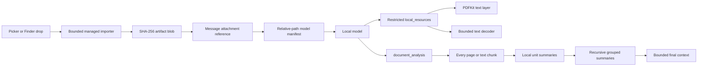

# Document Attachments

## Product behavior

PrivateAI imports selected documents into managed local storage and associates them with a user message. Exact local details use bounded `local_resources` reads or searches. Whole-document summaries and reviews use `document_analysis`, which summarizes every extractable PDF page or text chunk to private local checkpoints and recursively reduces those summaries until one bounded result remains. Source content is not eagerly inserted into every model request. Raw model-input and Tool-result transcript rows do persist the content actually sent or returned, including extracted text and intermediate summaries.

Users can select multiple documents from the composer or drop Finder file URLs onto it. Import must finish before send. A turn requires a non-empty user request and accepts up to 8 documents of 20 MiB each.

## Implemented formats

The first release supports 9 document categories represented by 38 filename extensions. The categories describe parser behavior; they are not 38 independent parsers.

| Category | Extensions | Reader behavior |
| --- | --- | --- |
| PDF | `pdf` | PDFKit text layer, page ranges, page-local continuation, page search |
| Markdown | `md`, `markdown` | Raw bounded text |
| Plain text | `txt`, `text`, `log`, extensionless files | Bounded text |
| Structured text | `json`, `jsonl`, `csv`, `tsv`, `xml`, `yaml`, `yml`, `toml`, `ini` | Raw bounded text preserving structure |
| HTML | `html`, `htm` | Raw bounded HTML; no scripts execute |
| Source code | `swift`, `m`, `mm`, `h`, `c`, `cc`, `cpp`, `js`, `jsx`, `ts`, `tsx`, `py`, `rb`, `go`, `rs`, `java`, `kt`, `kts`, `sh`, `zsh`, `sql` | Raw bounded source text |

Text decoding tries UTF-8, UTF-16, UTF-16 little-endian, UTF-16 big-endian, Windows-1252, and ISO Latin-1, then rejects implausible binary/control-heavy content. It does not silently replace malformed input.

PDF support means searchable PDFs with a real text layer. Locked PDFs and pages without extractable text return explicit failures. OCR is not currently implemented and scanned PDFs must not be reported as successfully read.

## Storage and access

- Import runs while the selected source URL's security scope is active and uses `NSFileCoordinator` for document-provider and iCloud-backed sources.
- The importer streams 64 KiB chunks, checks cancellation, stops at the byte limit, computes SHA-256, writes a private staging file, and atomically promotes it.
- Managed paths use `artifacts/blobs/<prefix>/<hash>/content.<extension>`. Database records store only relative paths and metadata.
- Files use mode `0600`; managed directories use `0700`.
- Duplicate content with the same format reuses one managed blob. Each message retains its own display name and order.
- Production `local_resources` is restricted to the managed artifacts root and to exact request-scoped files that the user explicitly references. Symlinks are resolved before the access check, and authorizing one file does not authorize its containing directory or siblings.
- Hierarchical summaries are stored under `~/.privateAI/jobs/document-summaries/<job-id>`. The job ID binds the document content hash, immutable model digest when available, extractor and prompt versions, and the complete pipeline configuration. Unit and reduction summaries are private `0600` files under `0700` directories.
- Page, source-chunk, and reduction summaries are task-aware. Every checkpoint key uses a full SHA-256 namespace for the user's analysis goal, so a later user request cannot reuse lossy summaries produced for a different goal.
- Within one Agent run, a structurally valid `document_analysis` retry for the same path reuses the first executed task argument. This lets a retry resume completed work even if the model paraphrases the goal after a transient failure, without treating paraphrases from separate user requests as the same cache key or crossing different document content.
- After a successful analysis, a later model round that calls `document_analysis` for the same canonical path reuses the prior bounded Tool result instead of building a second task namespace. Independent calls proposed together in one model response remain distinct.
- Jobs are content-addressed. Two authorized paths with identical bytes, model identity, pipeline configuration, and exact analysis goal may reuse the same validated checkpoints; path names are not part of the cache identity.
- A cancelled or interrupted hierarchical job keeps completed checkpoints. Repeating the same document and model resumes from validated files instead of recomputing completed units.
- Startup reconciliation removes interrupted staging files and unreferenced blobs, reports missing referenced files, and preserves imports still pending in the current session.

## Context efficiency

The model receives a compact, versioned JSON manifest containing display name, relative path, format, and byte count. It calls `document_analysis` once for whole-document work and `local_resources` only for targeted evidence.

`document_analysis` is a reusable hierarchical context reducer rather than a PDF-specific shortcut:

1. A source adapter produces bounded `ContextMaterial` units. PDFKit produces one unit per extractable page; text formats produce a document unit that is split on bounded UTF-8 byte ranges with paragraph-aware boundaries when needed.
2. Missing source units are packed in document order into structured leaf requests of at most 4 units. Segmentation and grouping use the actual JSON-encoded byte count, not a raw-text estimate. Up to 2 leaf requests run concurrently. The model must return exactly one independently validated summary per indexed source unit.
3. At both leaf and reduction levels, a recoverable batch failure is divided from 4 inputs to 2 and then 1. A failed single-input request is retried once; the finite request budget prevents retry loops.
4. Each completed page or chunk summary is atomically checkpointed in a checksum-validated JSON envelope as soon as its batch returns. A failing concurrent sibling does not discard the completed batch.
5. Summaries are grouped in document order, four at a time within the encoded input budget, and summarized again. Independent groups run with concurrency 2, checkpoint as they finish, and are reconstructed in their original order. An oversized intermediate summary is split before the next request and remains part of the reduction graph instead of failing the document.
6. Step 5 repeats until one bounded summary fits the outer Agent context. The final node must satisfy both the 9,000-character target and a 12 KiB JSON-encoded output budget, keeping the complete Tool result below the runtime's 16 KiB limit. The byte budget is the controlling safety boundary; the character target leaves enough room for faithful broad-document coverage.
7. If a run is interrupted, the next compatible job loads completed summaries and continues from the first missing checkpoint.

The defaults cover up to 32 MiB of extracted text, 8,192 segments, and 4,096 model requests with a six-hour safety deadline. These are explicit resource limits rather than context-window limits: increasing them extends the same task graph without changing the algorithm.

Each local-model request has a ten-minute deadline. Leaf and reduction responses both use JSON Schema constrained decoding; malformed, truncated, or timed-out groups enter the same finite adaptive split path instead of invalidating completed siblings.

The App reports internal request progress while the Tool runs: leaf versus reduction phase, input count, completed checkpoint count, and Ollama output tokens per second. The local transcript also stores raw auxiliary requests and model output, which can contain document text, task text, paths, and intermediate summaries. Runtime logs remain metadata-only. Diagnostic transcript rows are excluded from future model history.

Request and global deadlines are cooperative at the `ModelProvider` boundary. The production Ollama provider uses cancellable `URLSession` tasks. A future non-cooperative provider would require an isolated, terminable worker process before the same value could be described as a hard deadline.

This keeps all source coverage while preventing page text and every intermediate summary from accumulating in the outer 8,192-token Tool loop. If the ordinary Agent Tool budget is nevertheless exhausted, the runtime removes Tool schemas and requests one evidence-bounded final answer instead of failing immediately with a tool-budget error.

The App limits each read result to 2,000 characters. Text reads return `next_character_offset`; PDF reads return `next_page` and `next_page_offset`. PDF search scans at most 500 pages per call and returns `next_page` when more pages remain. This keeps even multibyte or escaped JSON results within the 16 KiB ToolRuntime result limit and prevents a large result from consuming or being dropped by the 8,192-token model context while allowing deterministic continuation.

Document content is treated as untrusted data in the stable system prompt. File names are JSON encoded, and neither document text nor full tool output is copied into runtime logs.

Any request containing a document attachment or an App-verified local file reference runs in document privacy mode: the model receives only `document_analysis` and `local_resources`, not Web or Apple service Tools. For user-entered paths, the App recognizes bounded path representations such as POSIX paths, shell-escaped paths, quoted paths, tilde-prefixed paths, and file URLs, verifies the real file, and grants access only to that resolved file. The Tool schema requires the model to normalize the user's representation into a canonical unescaped absolute POSIX path before calling. Neither the model nor shell evaluation creates authorization. Combining private documents with external Tools requires a future App-owned confirmation flow; system-prompt instructions alone are not treated as an authorization boundary.

## Failure states

The implementation distinguishes unsupported format, non-regular file, import cancellation, file too large, coordinated-read failure, invalid managed path, path outside the authorized root, unreadable or locked PDF, PDF without extractable text, invalid continuation range, unreliable text decoding, excessive source units, empty intermediate model output, oversized intermediate output, and a reduction that does not converge within the configured level limit.

## Expansion order

1. Add native RTF/RTFD extraction with `NSAttributedString`, gated by real fixtures and direct tests.
2. Add image and scanned-PDF OCR with Vision as an explicit opt-in derived representation, preserving page provenance and confidence.
3. Add DOCX using a maintained OOXML parser or a small format-specific extractor with representative Word fixtures. Do not infer support from filename acceptance.
4. Add EPUB only with a proven EPUB container/parser library and chapter provenance.
5. Add indexed retrieval for targeted cross-document questions only after real workloads exceed on-demand page/range reads and hierarchical summaries. Embeddings are not required for whole-document summarization.

Each new category requires a real executor, strict limits, structured failure results, direct fixture coverage, and a model-driven final-answer assertion before it is described as supported.